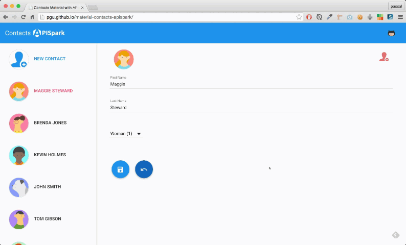
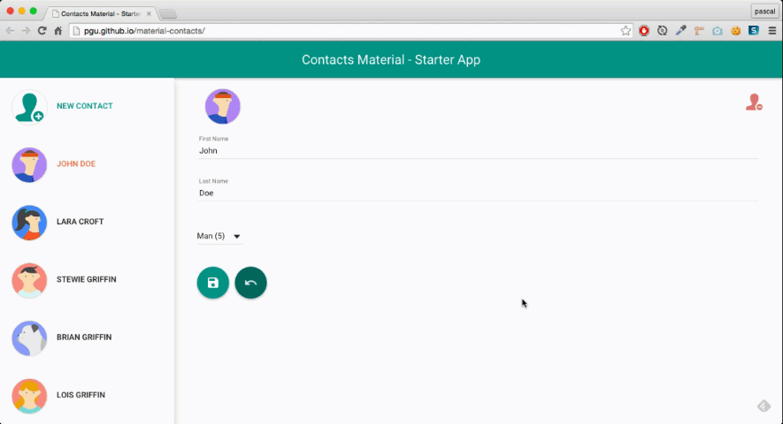

## Material contacts with APISpark :honeybee:

The demo is [>> here <<](http://pgu.github.io/material-contacts-apispark/)

- the application is connected to an API, hosted on [APISpark](http://restlet.com/products/apispark/)
- the code is "forked" from [angular-material starter](https://github.com/angular/material-start)
- the SVG files come from
 - [material design icons](https://github.com/google/material-design-icons)
 - [iconmonstr](http://iconmonstr.com/)

Also, there is a standalone (without server) version [>> here <<](http://pgu.github.io/material-contacts/)

The design and concept come from [angular-material](https://github.com/angular/material-start). You can visit an online version [>> here <<](http://pgu.github.io/material-start/) from this [fork](https://github.com/pgu/material-start).
